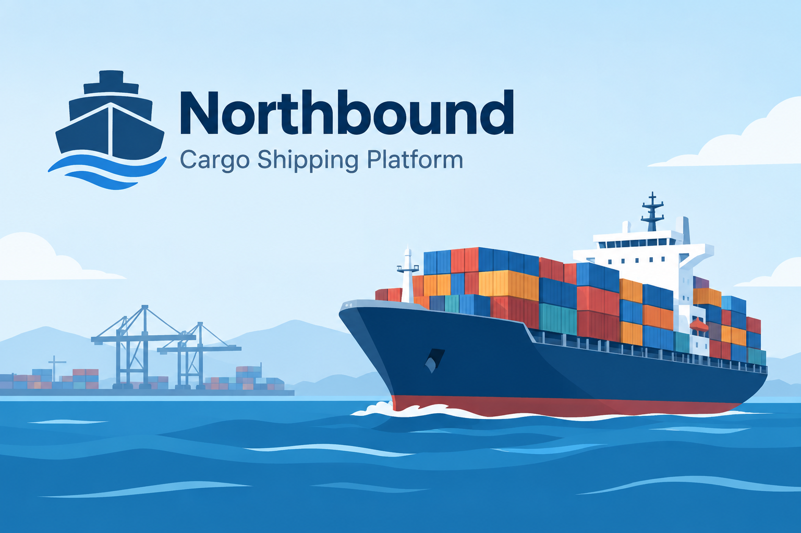

# Northbound

Northbound is the companion codebase for *Claude Code Demystified: Your
First 30 Days With Claude Code*, by Dan Castro. It is a small, deliberately
imperfect internal tool for a fictional logistics company, tracking
shipment status across three carriers.

It is not a clean tutorial repo on purpose. Real code looks like this,
not like a fresh scaffold, and the book's Part 2 onward is built around
working with it as it actually is.

## Stack

- Node.js + TypeScript
- Express
- PostgreSQL (via `pg`), with an in-memory fallback for local dev and
  tests so you do not need Postgres running just to follow along
- Jest

## Getting started

```bash
npm install
npm test          # runs the existing test suite
npm run typecheck
npm run dev        # starts the API on http://localhost:3000
```

No database setup is required to run the app or the tests as they
stand. If you want the real Postgres connection wired up (relevant
from chapter 12 onward, when the book connects an MCP server to it):

```bash
cp .env.example .env
docker compose up -d
```

## Layout

```
src/
  carriers/
    anchor.ts       the cleanest of the three integrations
    harborline.ts    correct logic, inconsistent naming
    trailhead.ts      the newest, and the one with the bug from chapter 5
    shared.ts         status logic all three carriers call into
    __tests__/         the existing (incomplete) test suite
  server.ts           a small Express API in front of it all
  shipmentStore.ts     in-memory store standing in for Postgres locally
config/
  legacy.settings.json  the file nobody on the team fully understands
```

## How to use this repo

There is one branch, `main`, and it is the starting point the book assumes
for Part 2. It intentionally has the Trailhead Cargo bug still in it, no
CLAUDE.md yet, and no skills, subagents, plugins, or MCP configuration.
You add those yourself, chapter by chapter, by running the prompts from the
book in your own copy.

Claude Code is not deterministic, so your diffs will not match the book line
for line. That is expected. What matters is that each result does what the
book describes. As chapter 7 recommends, create a branch of your own before
each exercise rather than working on `main`.

The Python material from Part 4 (the API experiments and the capstone
assistant) and the `northbound-toolkit` plugin from chapter 10 are not part
of this codebase. They live in
[claude-code-demystified-examples](https://github.com/danilocastronz/claude-code-demystified-examples).
